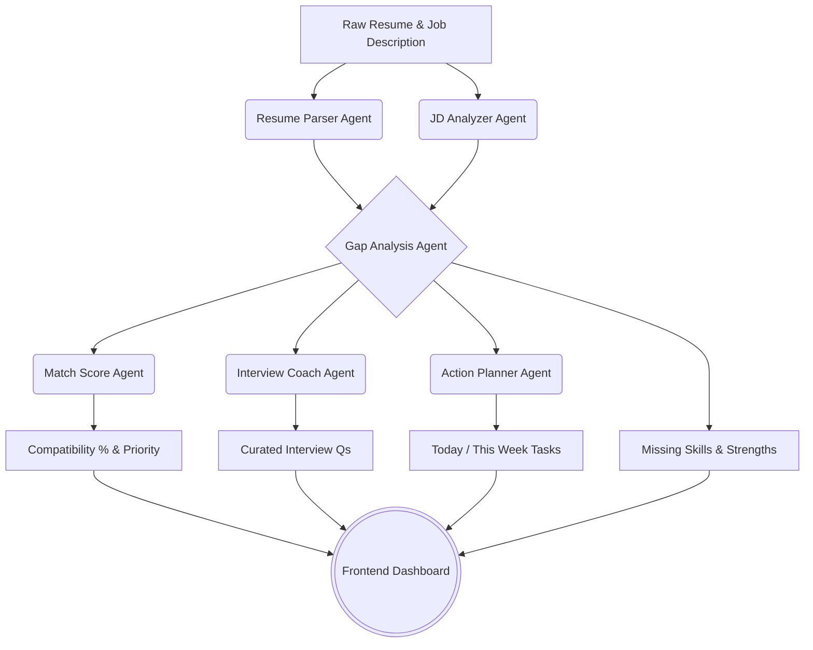
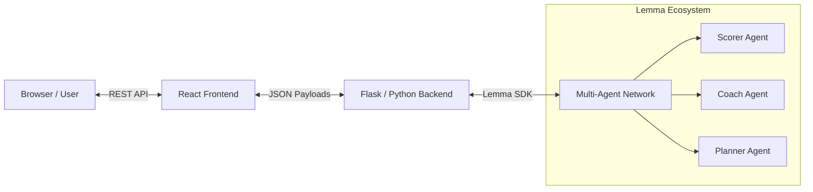
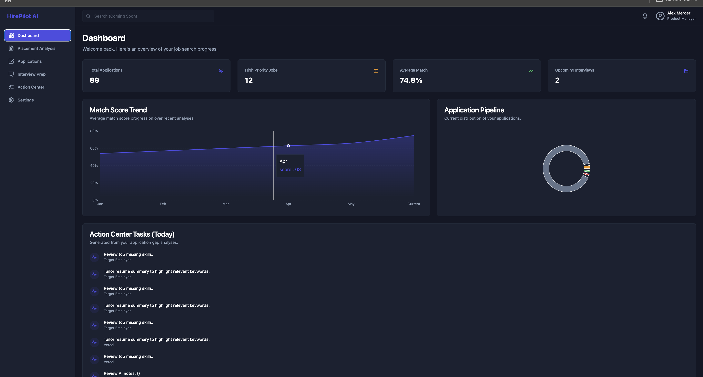
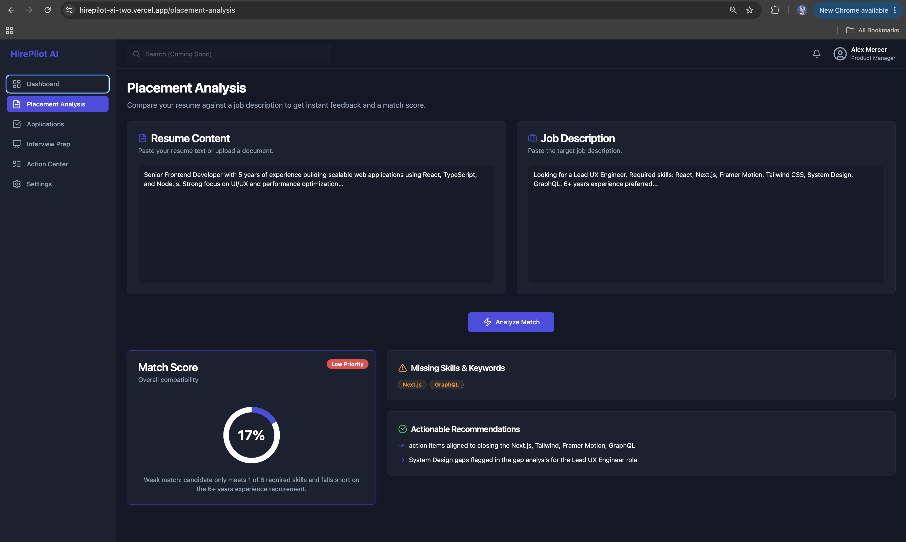
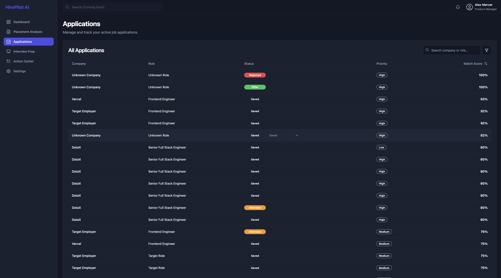
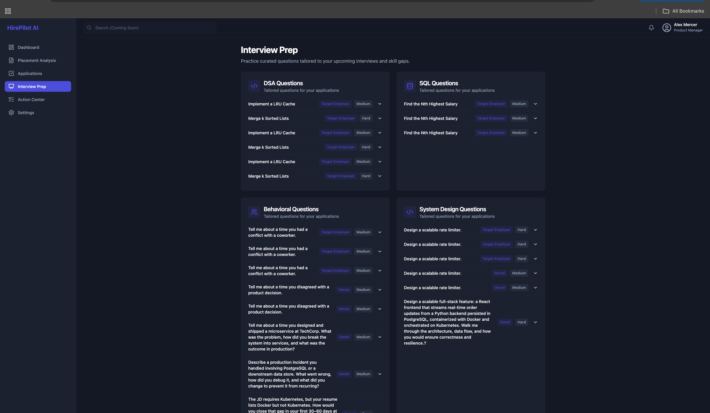
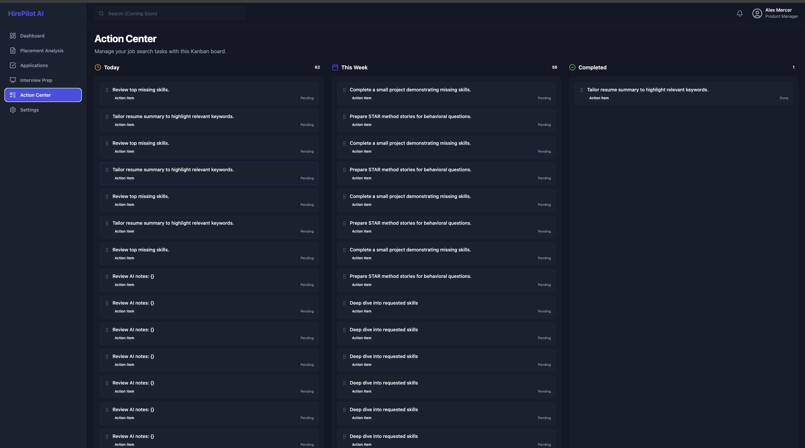
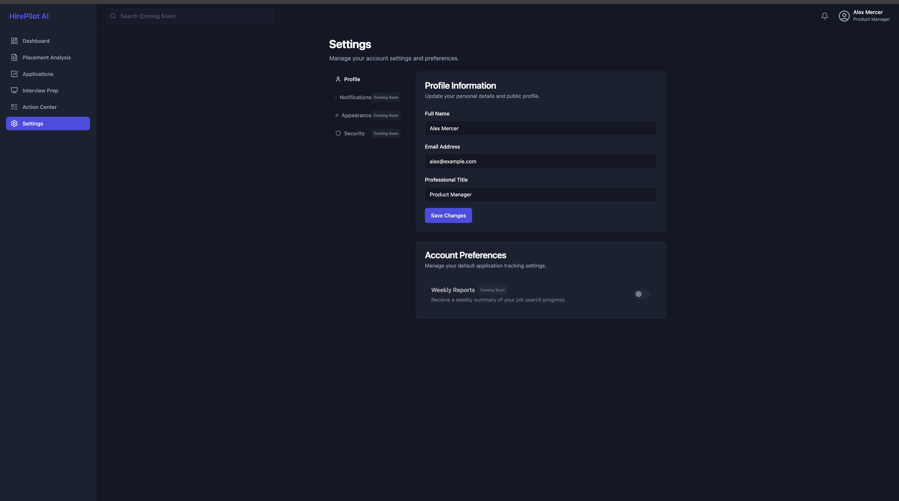

<div align="center">

# 🚀 HirePilot AI

**AI-Powered Placement Command Centre for Students & Job Seekers**

[](#)
[](#)
[](#)
[](#)
[](#)

*🏆 Built for the Gappy AI National Hackathon 2026
Powered by Lemma SDK***

[🌐 Live Demo](https://hirepilot-ai-two.vercel.app/) ·
[⚙️ Backend API](https://hirepilot-ai-d4ak.onrender.com/) ·
[🎥 Demo Video](https://youtu.be/YOUR_VIDEO_LINK)
</div>

---

## 🎯 Problem Statement?

**The Placement Problem**

HirePilot AI orchestrates multiple specialized AI agents using the Lemma SDK to transform unstructured AI outputs into structured placement intelligence.

For students and job seekers, the placement journey is intensely fragmented. Candidates constantly bounce between static resume builders, generic AI chatbots for interview prep, chaotic spreadsheets for tracking applications, and scattered notes for skill improvement. 

**The Flaw in Current AI Tools**
Current solutions treat AI as a mere question-answering tool. You paste a resume into a chatbot, get a generic wall of text, and then manually figure out what to do next. There is no workflow, no persistence, and no holistic product thinking.

**The Command Centre Approach**
HirePilot AI flips this paradigm. Instead of a chatbot, it is a **Placement Command Centre**. We utilize AI to actively *manage* the workflow. By orchestrating multiple specialized AI agents, HirePilot transforms raw documents into structured, actionable, and prioritized placement intelligence.

---

## 💡 Solution: Product-Driven AI

HirePilot AI solves the complete placement workflow through intentional product design. 

We mapped the actual user journey of a job seeker and replaced the friction points with autonomous AI agents. Rather than dumping raw AI prose onto the screen, our backend rigorously parses agent outputs into structured JSON. This powers a highly visual dashboard where candidates can instantly see their match probability, track missing skills, and execute personalized learning plans without ever reading a generic block of generated text.

> [!NOTE]
> **Hackathon Execution Focus**
> Every feature in HirePilot AI is designed to be immediately useful. We strictly avoided "AI for the sake of AI," ensuring every agent call translates directly into a tangible UI component that helps a candidate land a job.

---

## ✨ Core Features

| Feature | Description |
| :--- | :--- |
| 📄 **Resume & JD Analysis** | Agents independently parse the nuances of both the candidate's resume and the target job description. |
| ⚖️ **Gap Analysis** | Cross-references parsed data to surface critical discrepancies and strengths. |
| 🎯 **AI Match Score** | Calculates a deterministic compatibility percentage to help prioritize applications. |
| 🔍 **Missing Skill Detection** | Extracts missing keywords to help bypass ATS filters. |
| 📝 **Actionable Recommendations** | Generates tailored advice on how to bridge identified skill gaps. |
| 💬 **Interview Preparation** | Dynamically curates technical and behavioral questions based on the exact job requirements. |
| 📊 **Progress Dashboard** | A centralized hub to monitor application status and average match scores over time. |
| 📋 **Application Organizer** | Tracks all active job applications and automatically prioritizes them. |
| 📅 **AI Action Plans** | Generates highly personalized "Today" and "This Week" task lists to direct the user's focus. |

---

## 🤖 AI Workflow & Lemma SDK Utilization

The heart of HirePilot AI is its multi-agent orchestration. We heavily utilized the **Lemma SDK** to create specialized agents that execute in a sequential pipeline. Instead of a single generalized prompt, we rely on dedicated agents—each with a singular, focused objective—to ensure high-quality, structured output.



> [!TIP]
> **Meaningful Lemma SDK Usage**
> By splitting the cognitive load across multiple Lemma agents (Scorer, Coach, Planner), we achieve deterministic, high-fidelity results. The SDK allows our Python backend to orchestrate these conversations synchronously and parse the resulting intelligence into a strict REST API.

---

## 🏗️ System Architecture



---

## 📸 Screenshots

<div align="center">
  
  
</div>
<br>
<div align="center">
  
  
</div>
<br>
<div align="center">
  
  
</div>

---

## 💻 Tech Stack

| Layer | Technology | Purpose |
| :--- | :--- | :--- |
| **Frontend** | React, TypeScript, Vite | Fast, typed, modern UI foundation |
| **Styling** | Tailwind CSS | Utility-first, responsive design system |
| **Backend** | Python, Flask | Robust API routing and workflow orchestration |
| **AI Integration**| Lemma SDK | Seamless communication with the multi-agent network |
| **Architecture** | Multi-Agent System | Specialized AI roles for accuracy and speed |

---

## 🚀 Local Installation

### Prerequisites
- Node.js (v18+)
- Python (3.10+)

### 1. Clone the Repository
```bash
git clone git clone https://github.com/Harsh-PAHADIA/Hirepilot-AI.git
cd Hirepilot-AI
```

### 2. Backend Setup
```bash
cd backend
python -m venv venv
source venv/bin/activate  # On Windows: venv\Scripts\activate
pip install -r requirements.txt
```

### 3. Frontend Setup
```bash
cd ../frontend
npm install
```

### 4. Run the Application
Start the backend (Terminal 1):
```bash
cd backend
python main.py
```
Start the frontend (Terminal 2):
```bash
cd frontend
npm run dev
```

---

## 🔐 Environment Variables

Create a `.env` file in the `backend` directory.

> [!WARNING]
> **Security Best Practice**
> Never commit your `.env` file or expose your Lemma Token in public repositories.

```env
LEMMA_TOKEN=your_lemma_access_token
LEMMA_POD_ID=your_target_pod_id
LEMMA_ORG_ID=your_organization_id
```

---

## 📂 Project Structure

```text
hirepilot-ai/
├── backend/
│   ├── routes/              # API endpoints (analysis, dashboard, etc.)
│   ├── services/            # Lemma SDK integration and parsers
│   ├── workflows/           # Multi-agent orchestration logic
│   ├── main.py              # Application entry point
│   └── requirements.txt     # Python dependencies
├── frontend/
│   ├── src/
│   │   ├── components/      # Reusable UI components
│   │   ├── pages/           # Dashboard, Placement Analysis, etc.
│   │   ├── lib/             # Utilities and API config
│   │   └── App.tsx          # React root
│   ├── package.json
│   └── tailwind.config.js
└── README.md
```

---

## 🔭 Future Scope

While HirePilot AI currently handles the core placement workflow, our roadmap includes:

- **Resume PDF Export:** Dynamically generate ATS-optimized PDFs based on agent recommendations.
- **AI Mock Interviews:** Voice-to-text integration for real-time conversational practice.
- **Company-Specific Preparation:** Pulling live company culture and recent news data into the Gap Analysis agent.
- **Learning Roadmaps:** Auto-generating week-by-week syllabus links for missing skills.
- **Authentication & Persistent Storage:** User accounts to save history across devices securely.

---

## ⭐ Why HirePilot AI is Different

Unlike traditional AI resume analyzers that return long paragraphs of text,
HirePilot AI converts AI outputs into structured actions.

Instead of telling users what is wrong,
it tells them what to do next.

• Analyze resume
• Compare against JD
• Identify missing skills
• Prioritize applications
• Generate interview questions
• Create personalized action plans

The result is an AI Placement Command Centre rather than another chatbot.

## 👤 Developer

**Harshita Pahadia**

- Solo Builder
- Full Stack Developer
- AI Integration
- Backend Development
- UI/UX Design
- Deployment

---

## 📄 License

This project is licensed under the **MIT License**.


<div align="center">


